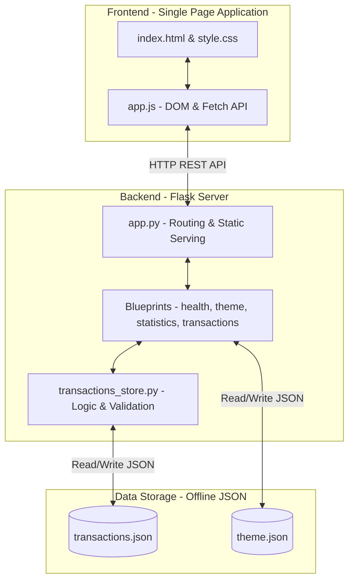

# PRESENTASI: Expense Tracker Pro 📊
*Pelacak Pengeluaran Offline-First yang Ringan, Cepat, dan Aman*

---

## 1. MASALAH (Problem Statement)
Pencatatan pengeluaran merupakan kunci manajemen keuangan pribadi. Namun, ada beberapa hambatan utama yang sering ditemui pengguna:

*   **Kompleksitas Aplikasi Cloud**: Banyak aplikasi pelacak keuangan yang memerlukan koneksi internet, pendaftaran akun pihak ketiga, dan sering kali dipenuhi dengan iklan.
*   **Masalah Privasi Data**: Menyimpan data pengeluaran pribadi (yang sensitif) di server cloud eksternal menimbulkan risiko kebocoran data.
*   **Instalasi Database yang Rumit**: Aplikasi desktop/lokal sering kali mengharuskan pengguna melakukan konfigurasi basis data relasional yang rumit (seperti MySQL, PostgreSQL) sebelum aplikasi dapat dijalankan.
*   **User Interface yang Tidak Fleksibel**: Sebagian besar aplikasi tidak mendukung pengeditan data secara cepat dan praktis (seperti pengeditan langsung di tabel transaksi/inline editing).

> [!WARNING]
> Ketergantungan pada koneksi internet dan cloud database membuat pencatatan harian menjadi lambat dan kurang aman bagi sebagian pengguna yang memprioritaskan privasi penuh.

---

## 2. SOLUSI (Demo Aplikasi)
**Expense Tracker Pro** hadir sebagai solusi aplikasi pelacak pengeluaran berbasis web offline-first. Aplikasi ini menggabungkan performa tinggi dan kepraktisan tanpa konfigurasi database eksternal yang rumit.

### Demo Alur Penggunaan Aplikasi:
1.  **Menjalankan Aplikasi (Satu Perintah)**:
    Pengguna cukup menjalankan file entrypoint [run.py](file:///c:/Users/hanif/OneDrive/Desktop/Expense-Tracker-Pro/run.py) melalui terminal:
    ```bash
    python run.py
    ```
    *Aplikasi secara otomatis membuka browser pengguna langsung mengarah ke alamat local server ([http://127.0.0.1:5000/](http://127.0.0.1:5000/)).*

2.  **Dashboard Utama (SPA)**:
    *   Pengguna langsung melihat ringkasan **Total Pengeluaran** dan tabel **Riwayat Transaksi** secara real-time.
    *   Terintegrasi dengan filter periode waktu (Mingguan, Bulanan, Semua) untuk melihat statistik pengeluaran.

3.  **Tambah Transaksi Praktis**:
    *   Formulir input di [index.html](file:///c:/Users/hanif/OneDrive/Desktop/Expense-Tracker-Pro/frontend/index.html) mendeteksi jika tanggal dikosongkan, maka sistem otomatis mengisinya dengan tanggal hari ini (`DD-MM-YYYY`).

4.  **Inline Edit & Delete**:
    *   Pengguna dapat mengubah data transaksi langsung pada baris tabel (tanpa membuka modal atau berpindah halaman). Kolom berubah menjadi input field secara dinamis, lengkap dengan tombol `Simpan` dan `Batal` (atau tombol shortcut `Enter`/`Escape`).

5.  **Dukungan Dual-Theme (Mode Terang/Gelap)**:
    *   Dapat beralih tema dengan satu klik tombol yang secara instan merubah style [style.css](file:///c:/Users/hanif/OneDrive/Desktop/Expense-Tracker-Pro/frontend/css/style.css) dan menyinkronkan pengaturan ke preferensi server serta browser Local Storage.

---

## 3. ARSITEKTUR SISTEM
Aplikasi ini dirancang dengan prinsip **Separation of Concerns (SoC)** menggunakan arsitektur Client-Server sederhana berbasis berkas lokal JSON sebagai pengganti database tradisional.

### Diagram Arsitektur Sistem (Mermaid)


### Penjelasan Komponen Arsitektur:
*   **Client Side (Frontend SPA)**: Dibangun dengan HTML/CSS/JS murni (Vanilla). [app.js](file:///c:/Users/hanif/OneDrive/Desktop/Expense-Tracker-Pro/frontend/js/app.js) menangani manajemen state tampilan, interaksi DOM, dan pemanggilan API endpoint menggunakan fungsi `fetch()`.
*   **Server Side (Backend Flask)**: [app.py](file:///c:/Users/hanif/OneDrive/Desktop/Expense-Tracker-Pro/backend/app.py) memetakan rute statis frontend dan membagi rute API melalui blueprint di folder `backend/routes/`.
*   **Database Helper (Transactions Store)**: [transactions_store.py](file:///c:/Users/hanif/OneDrive/Desktop/Expense-Tracker-Pro/backend/database/transactions_store.py) bertugas menangani validasi input (seperti memastikan `amount` positif dan tanggal berformat benar) serta melakukan operasi CRUD langsung ke berkas JSON lokal.

---

## 4. FITUR-FITUR UNGGULAN
Berikut adalah matriks fungsionalitas utama yang ditawarkan oleh Expense Tracker Pro:

| Nama Fitur | Deskripsi Teknis | File Implementasi Terkait |
| :--- | :--- | :--- |
| **Offline-First Storage** | Data disimpan di local storage komputer klien menggunakan berkas terstruktur JSON tanpa memerlukan konfigurasi database. | [transactions_store.py](file:///c:/Users/hanif/OneDrive/Desktop/Expense-Tracker-Pro/backend/database/transactions_store.py) |
| **Peralihan Tema Dinamis** | Sinkronisasi tema Light/Dark antara frontend LocalStorage dan backend JSON database. | [theme.py](file:///c:/Users/hanif/OneDrive/Desktop/Expense-Tracker-Pro/backend/routes/theme.py) & [style.css](file:///c:/Users/hanif/OneDrive/Desktop/Expense-Tracker-Pro/frontend/css/style.css) |
| **Inline Table Editing** | Fitur mengubah transaksi langsung di baris tabel (tidak mengganggu alur visual dengan modal popup). | [app.js](file:///c:/Users/hanif/OneDrive/Desktop/Expense-Tracker-Pro/frontend/js/app.js#L308-L368) |
| **Filter Periode Statistik** | Kalkulasi dan agregasi pengeluaran berdasarkan rentang dinamis: Mingguan (7 hari terakhir), Bulanan (bulan berjalan), atau Semua periode. | [statistics.py](file:///c:/Users/hanif/OneDrive/Desktop/Expense-Tracker-Pro/backend/routes/statistics.py) |
| **Auto-Recovery Database** | Jika data JSON rusak atau terhapus, sistem akan otomatis melakukan recovery (reset) ke array kosong `[]` tanpa menyebabkan server crash. | [transactions_store.py](file:///c:/Users/hanif/OneDrive/Desktop/Expense-Tracker-Pro/backend/database/transactions_store.py#L24-L35) |

---

## 5. KESIMPULAN & EVALUASI

### Kesimpulan
**Expense Tracker Pro** berhasil membuktikan bahwa pelacak keuangan yang canggih tidak harus rumit secara infrastruktur. Kombinasi Flask dan Vanilla JS SPA menawarkan performa aplikasi yang sangat ringan (loading instan), tingkat privasi data yang absolut (data 100% lokal), dan portabilitas tinggi (folder proyek dapat langsung dipindahkan dan dijalankan di komputer mana pun yang memiliki Python).

### Evaluasi & Limitasi Saat Ini
*   **Identitas Transaksi Menggunakan Array Index**: Saat ini, operasi edit/delete mengandalkan index array (0, 1, 2...). Hal ini efisien tetapi rentan terhadap konflik data (*race condition*) apabila aplikasi diakses oleh lebih dari satu tab atau pengguna secara bersamaan.
*   **Validasi Tanggal Terbatas**: Konversi format tanggal masih bertumpu pada input HTML tipe date dan string parser manual di backend.
*   **Visualisasi Data Masih Sederhana**: Statistik kategori pengeluaran dikirimkan oleh backend dalam struktur berformat pie chart data, namun belum digambar dalam bentuk diagram lingkaran interaktif di frontend karena hilangnya visualizer library.

### Rencana Tindak Lanjut & Solusi Masa Depan
1.  **Migrasi ke UUID**: Mengubah identitas transaksi dari Array Index menjadi ID berbasis UUID guna meningkatkan keandalan transaksi data saat skala aplikasi berkembang.
2.  **Integrasi Chart Visualizer**: Memasang library visualisasi mandiri (seperti Chart.js atau visualisasi berbasis SVG murni) untuk menggambarkan grafik lingkaran kategori pengeluaran pada bagian tab statistik.
3.  **Ekspor Laporan**: Menambahkan fitur ekspor data riwayat transaksi pengeluaran ke dalam format CSV atau file Excel (XLSX).
