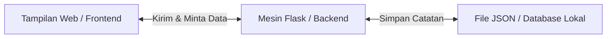

# PRESENTASI: Expense Tracker Pro 💸
*Aplikasi Catat Jajan Simpel, Bebas Kuota, Ga Pake Ribet!*

---

## 1. MASALAH (Kenapa Uang Jajan Cepat Habis?)
Sebagai anak sekolah, kita sering ngalamin masalah ini:
*   **Tiba-Tiba Kanker (Kantong Kering)**: Sering bingung uang jajan mingguan habis buat apa saja.
*   **Aplikasi Lain Ribet**: Aplikasi pencatat keuangan di HP biasanya penuh iklan, wajib login pakai email, dan harus pakai kuota internet.
*   **Data Ga Aman**: Takut ketahuan orang lain kalau catatan keuangan kita disimpan di server luar.
*   **Susah Setup-nya**: Kalau mau bikin aplikasi pencatat sendiri, biasanya harus instal database yang rumit (seperti MySQL).

> [!TIP]
> Makanya, kita butuh aplikasi pencatat jajan yang super cepat, bisa dibuka offline (tanpa kuota), dan tampilannya simpel!

---

## 2. SOLUSI & DEMO APLIKASI
Kita bikin **Expense Tracker Pro**, aplikasi web pencatat jajan yang dipasang di laptop sendiri.

### Cara Mainnya Gampang Banget:
1.  **Tinggal Klik & Jalan**: Buka file [run.py](file:///c:/Users/hanif/OneDrive/Desktop/Expense-Tracker-Pro/run.py), dan browser kamu bakal otomatis terbuka ke halaman aplikasi.
2.  **Input Ga Pake Mikir**: Masukkan nama jajan (misal: "Beli Kopi"), kategori ("Makanan"), jumlah uang, dan simpan. Tanggalnya otomatis terisi hari ini kalau kamu kosongkan!
3.  **Edit Langsung (Inline Edit)**: Salah ketik jumlah uang? Tinggal klik tombol **Ubah** di tabel, edit angkanya langsung di baris itu, terus klik **Simpan**. Gampang kan?
4.  **Mode Gelap/Terang**: Ada tombol ganti tema biar mata ga sakit pas mencatat pengeluaran malam-malam.

---

## 3. ARSITEKTUR SISTEM (Cara Kerjanya)
Aplikasi ini dibagi menjadi 3 bagian utama yang saling kerja sama:

*   **Tampilan Web (Frontend)**: Yang kamu lihat di browser ([index.html](file:///c:/Users/hanif/OneDrive/Desktop/Expense-Tracker-Pro/frontend/index.html) & [app.js](file:///c:/Users/hanif/OneDrive/Desktop/Expense-Tracker-Pro/frontend/js/app.js)). Tempat kamu nge-klik dan ngisi formulir.
*   **Mesin Flask (Backend)**: Otak aplikasi kita ([app.py](file:///c:/Users/hanif/OneDrive/Desktop/Expense-Tracker-Pro/backend/app.py)). Tugasnya mengatur jalannya aplikasi dan memvalidasi data.
*   **File JSON (Database)**: Buku catatan rahasia di folder [backend/database/](file:///c:/Users/hanif/OneDrive/Desktop/Expense-Tracker-Pro/backend/database/). Semua jajanmu disimpan aman di sini dalam bentuk teks biasa.

---

## 4. FITUR KEREN
*   **Offline-First**: 100% ga butuh kuota internet buat buka dan catat jajan.
*   **Inline Edit**: Ga perlu buka-tutup halaman/pop-up baru cuma buat benerin catatan yang salah ketik.
*   **Filter Waktu**: Bisa lihat rangkuman jajan mingguan, bulanan, atau semuanya.
*   **Auto-Recovery**: Kalau file datanya rusak/terhapus, aplikasi ga bakal error atau macet. Otomatis dibikinkan catatan baru yang kosong!

---

## 5. KESIMPULAN & EVALUASI

### Kesimpulan
Aplikasi **Expense Tracker Pro** ini cocok banget buat kita anak sekolah yang mau belajar hemat. Ukuran aplikasinya ringan banget, jalannya cepat, aman, dan pastinya gratis tanpa iklan yang mengganggu.

### Apa yang Perlu Diperbaiki Nanti? (Evaluasi)
*   **ID Transaksi Masih Sederhana**: Saat ini sistem memakai nomor baris (index) sebagai ID. Kalau kita buka di dua tab browser sekaligus, bisa rawan salah update. Nanti mau diganti pakai ID unik (UUID).
*   **Belum Ada Grafik Keren**: Rencana ke depan mau ditambah grafik lingkaran (Pie Chart) berwarna-warni biar kelihatan kategori jajan apa yang paling bikin boros (misalnya buat game atau pacaran).
*   **Ekspor Data**: Nanti mau ditambah tombol "Download Excel" biar catatan jajan bisa dicetak atau dilaporin ke orang tua buat minta uang jajan tambahan!
